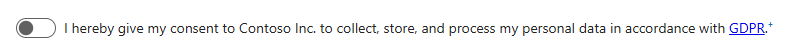

# Date as Toggle with multilingual support.


  

The **Date as Toggle** component, associated with a `DateTime` table column, offering an intuitive way to set or clear timestamps based on toggle actions.



The features of this component:

- **Toggle Functionality**: When the toggle is **selected**, the current **date and time are automatically set** in the associated DateTime column.
When the toggle is **unselected, the value is cleared**, effectively removing the timestamp.
- **Custom Descriptions**: Use `Display text` property to define a description text that is separate from the field's label, to provide additional context and guidance for users interacting with the toggle.
Descriptions are highly configurable and support plain text or html. Table column's `required` property is respected and either red asterisk `*`, or a blue plus `+` are displayed if the column is "Business required " or "Business recommended".


- **Multilingual Support**: The component fully supports multilingual configurations if the `Display text` is set to a JSON value. The toggle label is displayed based on the detected user language, or falls back to values defined in `default` if user's language is not supported.


The field's value may be set programmatically with the following JavaScript:

```javascript
//set to now
formContext.getAttribute("COLUMN_LOGICAL_NAME").setValue(new Date())

//reset to empty
formContext.getAttribute("COLUMN_LOGICAL_NAME").setValue(null)
```

