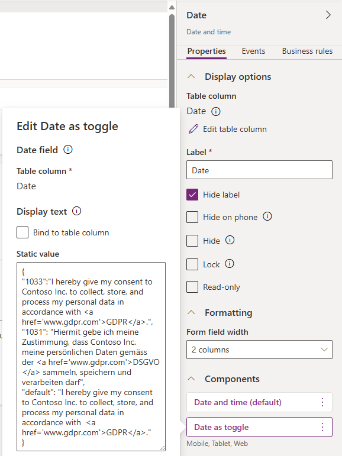

# Date as Toggle with multilingual support.


  

The **Date as Toggle** component is designed to interact with a `DateTime` column, offering an intuitive way to set or clear timestamps based on toggle actions.


Below are the main features of this component:

- **Toggle Functionality**: When the toggle is selected, the current date and time are automatically set in the associated DateTime column.
When the toggle is unselected, the value is cleared, effectively removing the timestamp.
- **Custom Descriptions**: This component allows you to define a description text that is separate from the field's label. This description provides additional context or guidance for users interacting with the toggle.
Descriptions are highly configurable and can be tailored to fit various use cases, offering clarity without needing to adjust the main field label.


- **Multilingual Support**: The component fully supports multilingual configurations. The description text is displayed based on the detected user language, using the value from `context.userSettings.languageId.toString()`. This ensures that users see the appropriate text in their preferred language, enhancing the overall experience. Use `default` for fallback:




The field's value may be set programmatically with the following JavaScript:

```javascript
//set to now
formContext.getAttribute("COLUMN_LOGICAL_NAME").setValue(new Date())

//reset to empty
formContext.getAttribute("COLUMN_LOGICAL_NAME").setValue(null)
```

