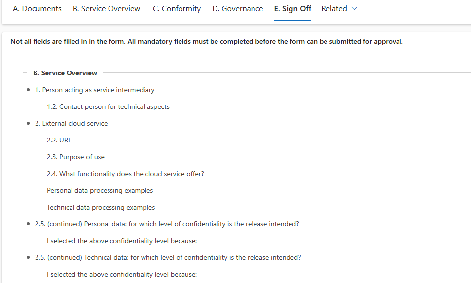
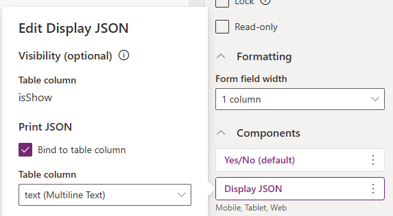

# Display JSON


  

Thw **Display JSON** component  is designed to display form validation information in a list format, providing clear feedback to users about validation errors or issues. This component offers flexibility through the use of additional columns for controlling both visibility and content display.



## How It Works

### Component Setup

- The `Yes/No` column is associated with the component to control its visibility.
- The `Print JSON` property is bound to the **hidden** `Multiple lines of text` column, which stores the validation messages in JSON format.

### Visibility and Flexibility

- The component’s visibility is controlled separately from its content, allowing for more granular control over when the validation summary should appear.

The column's value (`Yes/No`) determines whether the summary is displayed.

- If the column is set to visible, but the value is false, the validation summary won’t be shown, though the component will still occupy space in the form (appearing as an empty row).

- To fully hide the component, you must set the column to hidden. This can be achieved through column properties, business rules, or JavaScript.

Associate the `Display JSON` component with the `Yes/no` column, and bind the `Print JSON` property to the `Multiple lines of text` column:



## Dynamic Updates
Use the `validateForm` function (example below) to validate the form and dynamically update the value in the `Multiple lines of text` column based on validation outcomes. This allows you to control the validation summary, depending on the form's state.

```javascript

    var formContext = executionContext.getFormContext();
    const show = formContext.getAttribute("YESNO_COLUMN_LOGICAL_NAME").getValue();
    if(show){
        const validateResults = validateForm(formContext, [], []);
        if (validateResults.length > 0) {
            formContext.getAttribute("TEXT_COLUMN_LOGICAL_NAME").setValue(JSON.stringify(validateResults));
        }
    }
    else{
        formContext.getAttribute("TEXT_COLUMN_LOGICAL_NAME").setValue(null);
    }
```

A practical use case for this component is when validating a form on a **Sign Off** tab to inform users of any missing or invalid fields:

- **Initiate Validation in the On Tab State Change Event**:
When a user navigates to the Sign Off tab, you can trigger the `validateForm` function in the `On Tab State Change` event.
This function dynamically populates the hidden `Multiple lines of text` column with missing or invalid fields, and sets the `Yes/No` column value to display the validation summary.
- **Clear Validation on Save**: To prevent storing validation data in Dataverse, clear the contents of the hidden `Multiple lines of text` column in the `On Save` event of the form.
This ensures that no validation data is persisted once the form is saved, maintaining a clean data record.

## Set JSON value

### validateForm function

```javascript
/** Parses form and lists empty columns with "Busines required" or "Busines recommended" levels.
 * Omits tabs and sections defined in "skipTabs" and "skipSections"
 *
 * @param {*} formContext : formContext
 * @param {*} skipTabs : array of tab names to skip
 * @param {*} skipSections : array of section names to skip
 * @returns
 */
var validateForm = function (formContext, skipTabs, skipSections) {

    const fMandatory = formContext.data.entity.attributes.getByFilter((a) => { return a.getRequiredLevel() !== "none" });
    const fNull = fMandatory.filter(f => f.getValue() === null).map(f => f.getName())

    const getTabs = (formContext, skipTabs) => {
        return formContext.ui.tabs.getByFilter((t) => { return t.getVisible() && !skipTabs.includes(t.getName()) })
    }
    const getSections = (tab, skipSections) => {

        return tab.sections.getByFilter((s) => { return s.getVisible() && !skipSections?.includes(s.getName()) })
    }
    const getControls = (section) => {
        return section.controls.getByFilter((c) => { return fNull.includes(c.getName()) && c.getVisible() }).map(c => c.getLabel());
    }
    const getSectionInfo = (section) => {
        const controls = getControls(section);

        return (controls.length > 0)
            ? {
                name: section.getLabel(),
                controls: controls
            }
            : null;
    }
    const getInvalidSectionInfo = (t, skipSections) => {
        const sections = getSections(t, skipSections);
        return sections.map(s => getSectionInfo(s))
            .filter((value) => value !== null && value !== undefined)
    }
    const getTabInfo = (t, skipSections) => {
        const _sections = getInvalidSectionInfo(t, skipSections)
        return (_sections.length > 0)
            ? {
                name: t.getLabel(),
                sections: _sections
            }
            : null;
    }
    const getInvalidTabInfo = (formContext, skipTabs, skipSections) => {
        const tabs = getTabs(formContext, skipTabs);
        return tabs.map(t => getTabInfo(t, skipSections))
            .filter((value) => value !== null && value !== undefined)
    }

    return getInvalidTabInfo(formContext, skipTabs, skipSections);

}

```

### Static value


Although initially intended for dynamic content, this control can also be configured to display static text, allowing you to present information of your choice in a more organized manner.

Make sure to use the following schema.

```json
[
    {
        "name":"Section 1",
        "sections":[
            {
                "name": "Bullet point 1",
                "controls":[
                    "Bullet point 1, text 1"
                ]
            },
            {
                "name":"Bullet point 2",
                "controls":[
                    "Bullet point 2, text 1",
                    "Bullet point 2, text 2",
                    "Bullet point 2, text 3"
                ]
            }
        ]
    }
]
```

If the component doesn't display the contents, remove any trailing commas from the end of the array, and test the string you provided by using `JSON.parse()` in your browser console.