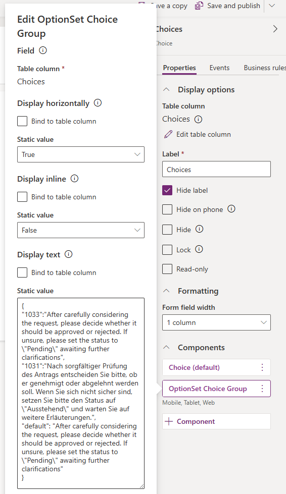
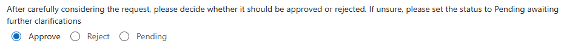
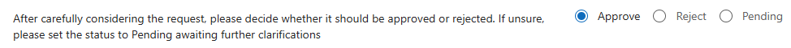
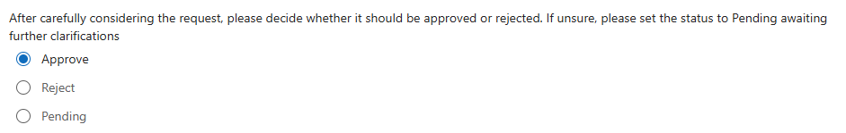
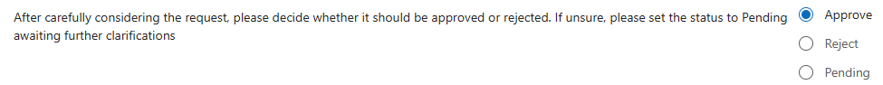

# OptionSet Choice Group

  

The **OptionSet Choice Group** component is designed to present choices defined in a `Choice` column table in a clear and organized way.
It displays OptionSet choices as a Choice Group, inline or below text, with choices displayed horizontally or vertically. Provides multilingual support.

This component simplifies the selection process, making forms easy to fill in, especially when there are multiple questions with the same answers (e.g., yes/no/not applicable).

## Features
- **Custom labels**: Define a custom label for the choice group, providing clear context and guidance for users.
- **Multilingual support**: The component supports multiple languages, ensuring the text displayed is appropriate for the user’s language settings. This option may be useful if the description associated with the choices is too long for the Power Platform translation mechanism.
- **Radio-button layout**: Choices are rendered as radio-buttons either horizontally or vertically, providing flexibility in how options are displayed.
- **Inline or below text**: The choices can be displayed inline with the custom text or below it, depending on your design preferences. If the choices are displayed inline, they will be always align to the right even if the question doesn't require it. This is to ensure choices are always displayed below each other.

## Configuration

To configure the **OptionSet Choice Group** component:

- **Add a `Choice` column**: Include a `Choice` column in your form and associate it with the **OptionSet Choice Group** component.
- **Set Display Text property**: The **Display text** property accepts either simple text or a JSON object specifying different text for various `LCID` language codes.  Use `default` for fallback.
The displayed text will automatically adapt to the user's language based on the user settings.

### Configuration options

#### Choices displayed horizontally, below text

#### Choices displayed horizontally, inline with text

#### Choices displayed vertically, below text

#### Choices displayed vertically, inline with text

