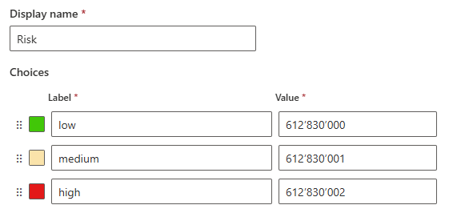
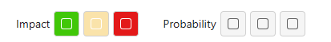
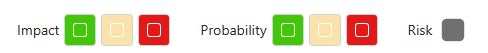
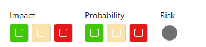
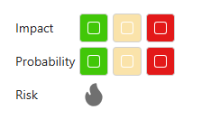
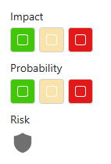
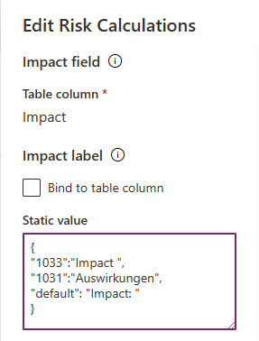
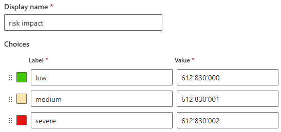
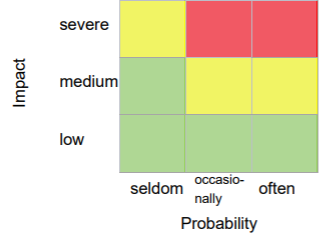

# Risk calculations


  

## Configuration

Ensure the following table columns exist:

| Column name | Column type |
| - | - |
| Impact | Choice |
| Probability | Choice |
| Risk | Choice |

Depending on the risk matrix you are using:

- 3x3 risk matrix
- 4x4 risk matrix
- 5x5 risk matrix

define appropriate choice values for the above choice fields. Create global choices if you plan on reusing these values elsewhere.

For all the above columns,  define colors in the choice configuration. If no colors are defined, gray will be used as a default color.



Import the **Risk calculations** component to the **Components** in your form and add it to the form. In the configuration panel, define the following properties:

| Property | Value |
| - | - |
| `Impact field` | Impact (Choice) column |
| `Impact label` | Either simple text or a JSON for multilingual support (see below) |
| `Probability field` | Probability (Choice) column |
| `Probability label` | Either simple text or a JSON for multilingual support (see below) |
| `Risk` | Risk (Choice) column |
| `Display risk`  | `True/False` - define whether calculated risk should be displayed within the component |
| `Risk label` | Either simple text or a JSON for multilingual support (see below). Used if `Display risk` is set to `True` |
| `Risk Icon`| `SquareFilled` (default),`CircleFilled`,  `FireFilled`, `ShieldFilled` fluent UI icon, used to represent the risk. The icon uses the color associated with the risk level. Used if `Display risk` is set to `True`|
| `Display fields inline` | `True/False` - controls whether the Impact, Probability and Risk fields are displayes inline, or one below another. |
| `Display labels inline`| `True/False` - controls whether field controls are displayed nexto to or above the choice fields |
| `Risk Definition`| JSON used to calculate risk level based on the available Impact and Probability fields. See [below](./README.md#risk-calculations) for details. |

Hide the label of the table column to ensure correct displaying of the control. The **Impact** and **Probability** choices are displayed using either colors defined for each option, or a default color gray.



Risk icon is displayed only if impact and probability are selected, and correct JSON Risk definition is provided in the component configuration.

In Edit mode, the risk icon is displayed if the `Display risk` property is set to `True`. This allows ensuring the User Interface is configured properly.
In this case the values necessary to calculate risk are missing, so the icon is displayed using gray color.

### Example configurations (edit mode)

| Display risk | Risk Icon | Display fields inline | Display labels inline | Preview (Edit mode) |
| - | - | -  | - | - |
| True | SquareFilled  | True  | True |   |
| True | CircleFilled | True | False |   |
| True | CircleFilled | False | True |   |
| True | CircleFilled | False | False |   |


### Multilingual labels

To provide multilingual values for  Impact, Probability and Riks labels, provide a JSON objects with
The `Impact label`, `Probability label` and `Risk label` properties accept either simple text or a JSON object specifying different text for various `LCID` language codes.  Use `default` for fallback.



### Risk calculations

Each choice option has a display label and a numerical value. In order to provide the `Risk Definition` JSON, use the values from the choice definitions.

Let's assume you are using the following choices for impact, probability and risk:

#### risk impact


#### risk probability


#### risk


In order to perform risk calculations using the following risk matrix:



you would need to define the following associations:

| Risk              | Impact             | Probability             |
|-------------------|--------------------|-------------------------|
| high `612830002`  | severe `612830002` | often `612830002`       |
|                   | severe `612830002` | ocasionally `612830001` |
| medium `612830001`| severe `612830002` | seldom `612830000`      |
|                   | medium `612830001` | ocassionaly `612830001` |
|                   | medium `612830001` | often `612830002`       |
| low `612830000`   | medium `612830001` | seldom `612830000`      |
|                   | low `612830000`    | seldom `612830000`      |
|                   | low `612830000`    | ocassionaly `612830001` |
|                   | low `612830000`    | often `612830002`       |

Which results in the following JSON:

```json
{
    "612830002": [
        {
            "impact": 612830002,
            "probability": 612830002
        },
        {
            "impact": 612830002,
            "probability": 612830001
        }
    ],
    "612830001": [
        {
            "impact": 612830002,
            "probability": 612830000
        },
        {
            "impact": 612830001,
            "probability": 612830001
        },
        {
            "impact": 612830001,
            "probability": 612830002
        }
    ],
    "612830000": [
        {
            "impact": 612830001,
            "probability": 612830000
        },
        {
            "impact": 612830000,
            "probability": 612830000
        },
        {
            "impact": 612830000,
            "probability": 612830001
        },
        {
            "impact": 612830000,
            "probability": 612830002
        }
    ]
}
```

## Resources

### Fluent UI React v9

- [Colors](https://react.fluentui.dev/?path=/docs/theme-colors--docs )
- [Icons catalog](https://react.fluentui.dev/?path=/docs/icons-catalog--docs)