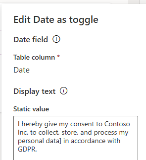
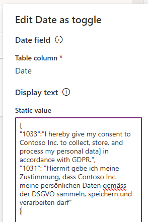

# Date as Toggle with multilingual support.

This toggle control, when connected to a DateTime column, sets the current time when the toggle is selected, and removes the value when it's unselected.

It allows you to define description unrelated to the field label.




For **multilingual support**, define the text in a json format:


The text will be displayed in the user's language, based on the `context.userSettings.languageId.toString()` value.


The control's value may be set programmatically with the following JavaScript:

```javascript
//set to now
formContext.getAttribute("LOGICAL_NAME").setValue(new Date())

//reset to empty
formContext.getAttribute("LOGICAL_NAME").setValue(null)
```


> This control is inspired by the [Date As Checkbox](https://pcf.gallery/date-as-checkbox/#:~:text=A%20control%20to%20transform%20a%20date%20time%20attribute%20in%20custom).