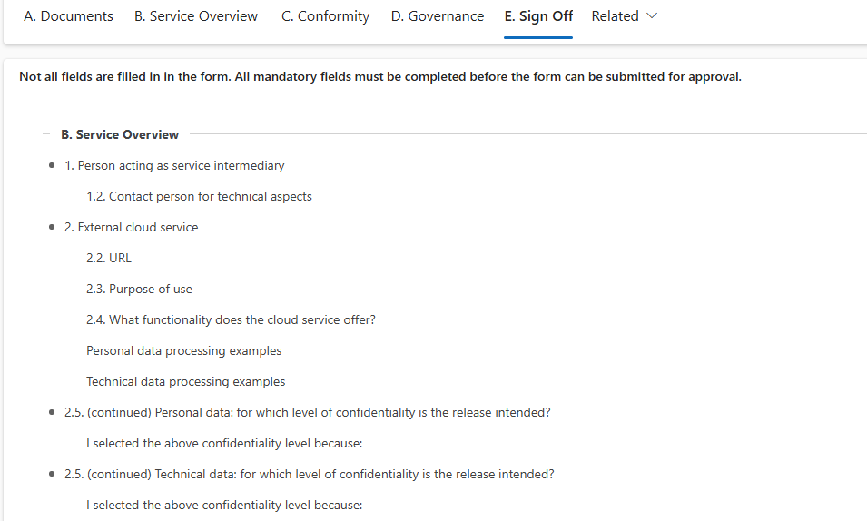
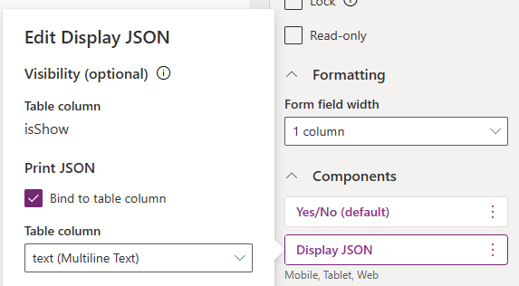

# Display JSON

This control displays form validation information in a list form:



## Configuration
To configure the control, make sure you have two additional fields added to the form:
- `Yes/no` field which defines whether the control will display the values and
- hidden `Multiple lines of text` column used as a source of the component; you may want to hide this field, because its value is dynamically set using `validateForm` function, and it is used only as a source for the component.

Associate the `Display JSON` component with the `Yes/no` field, and bind the `Print JSON` property to the `text` field



Use the `validateForm` function provided below to validate the form, and dynamically update the field value

```javascript
this.onHideShowValidation = function (executionContext) {
    var formContext = executionContext.getFormContext();
    const show = formContext.getAttribute("YESNO_CONTROL_LOGICAL_NAME").getValue();
    if(show){
        const validateResults = validateForm(formContext, [], []);
        if (validateResults.length > 0) {
            formContext.getAttribute("TEXT_CONTROL_LOGICAL_NAME").setValue(JSON.stringify(validateResults));
        }
    }
    else{
        formContext.getAttribute("TEXT_CONTROL_LOGICAL_NAME").setValue(null);
    }
}
```

For a more realistic example, you can initiate form validation in the `On Tab State Change` event of a `Sign Off` tab to inform the user about any missing fields. Then, in the "On Save" event of the form, clear the contents of this control to prevent the data from being stored in Dataverse.


## Visibility

The visibility of the control and the value of the `Yes/no` field both determine whether the summary is shown.

However, there's a distinction: if the control is visible but its value is set to `false`, the summary won't be displayed, but the control will still take up space, appearing as an empty row. If this is the only control in a section, the section will remain visible.

Only by hiding the control - using a business rule or JavaScript - will the space not be allocated.

## Set JSON value

### validateForm function

```javascript
/** Parses form and lists empty fields with "Busines required" or "Busines recommended" levels.
 * Omits tabs and sections defined in "skipTabs" and "skipSections"
 *
 * @param {*} formContext : formContext
 * @param {*} skipTabs : array of tab names to skip
 * @param {*} skipSections : array of section names to skip
 * @returns
 */
var validateForm = function (formContext, skipTabs, skipSections) {

    const fMandatory = formContext.data.entity.attributes.getByFilter((a) => { return a.getRequiredLevel() !== "none" });
    const fNull = fMandatory.filter(f => f.getValue() === null).map(f => f.getName())

    const getTabs = (formContext, skipTabs) => {
        return formContext.ui.tabs.getByFilter((t) => { return t.getVisible() && !skipTabs.includes(t.getName()) })
    }
    const getSections = (tab, skipSections) => {

        return tab.sections.getByFilter((s) => { return s.getVisible() && !skipSections?.includes(s.getName()) })
    }
    const getControls = (section) => {
        return section.controls.getByFilter((c) => { return fNull.includes(c.getName()) && c.getVisible() }).map(c => c.getLabel());
    }
    const getSectionInfo = (section) => {
        const controls = getControls(section);

        return (controls.length > 0)
            ? {
                name: section.getLabel(),
                controls: controls
            }
            : null;
    }
    const getInvalidSectionInfo = (t, skipSections) => {
        const sections = getSections(t, skipSections);
        return sections.map(s => getSectionInfo(s))
            .filter((value) => value !== null && value !== undefined)
    }
    const getTabInfo = (t, skipSections) => {
        const _sections = getInvalidSectionInfo(t, skipSections)
        return (_sections.length > 0)
            ? {
                name: t.getLabel(),
                sections: _sections
            }
            : null;
    }
    const getInvalidTabInfo = (formContext, skipTabs, skipSections) => {
        const tabs = getTabs(formContext, skipTabs);
        return tabs.map(t => getTabInfo(t, skipSections))
            .filter((value) => value !== null && value !== undefined)
    }

    return getInvalidTabInfo(formContext, skipTabs, skipSections);

}

```

### Static value


Although initially intended for dynamic content, this control can also be configured to display static text, allowing you to present information of your choice in a more organized manner.

Make sure to use the following schema.

```json
[
    {
        "name":"Section 1",
        "sections":[
            {
                "name": "Bullet point 1",
                "controls":[
                    "Bullet point 1, text 1"
                ]
            },
            {
                "name":"Bullet point 2",
                "controls":[
                    "Bullet point 2, text 1",
                    "Bullet point 2, text 2",
                    "Bullet point 2, text 3"
                ]
            }
        ]
    }
]
```

If the control isn't displaying the contents, remove any trailing commas from the end of the array, and test the string you provided by using `JSON.parse()` in your browser console.