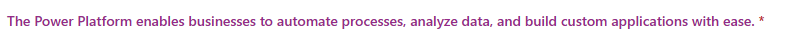
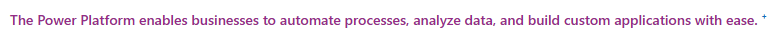

# Multilingual text

The **Multilingual Text** component allows flexible display of static text in model-driven apps by associating it with a form field. It is a flexible alternative to Web Resources for displaying localized, dynamic text.

- **Dynamic height**: Automatically adjusts height based on content, using only the space required.
- **Visibility control**: Text visibility can be controlled dynamically, based on form state (e.g., only showing text on new forms) or other field values.

## Key Features

- **Multilingual support**: Displays text in different languages, based on user settings.
- **Text formatting**: Supports basic formatting for improved readability.
- **Field configuration**: Honors field settings like Business Required, Business Recommended, or Optional.
- **Column security**: If column security is enabled, the text is hidden but still takes up space. Use business rules or JavaScript to prevent empty rows.

# Confguration

To configure the component, ensure  an additional column isadded to the form:
- `Yes/no` column which defines whether the component will display the text

Associate the `Multilingual Static Text` component with the `Yes/no` column, add text to the Text property (either simple text, or a json for multilingual support) and CSS style to the Text Style.

The following configuration:

displays the following text:

If the source control settings are changed to "Business recommended", the red asterisk will be replaced with a blue +.
Remember that just like in the case of out-of-the-box controls you need to refresh the page for the "required level" change to take effect.

## Visibility

The visibility of the control and the value of the `Yes/no` column both determine whether the summary is shown.

However, there's a distinction: if the control is visible but its value is set to `false`, the summary won't be displayed, but the control will still take up space, appearing as an empty row. If this is the only control in a section, the section will remain visible.

Only by hiding the control - using a business rule or JavaScript - will the space not be allocated.