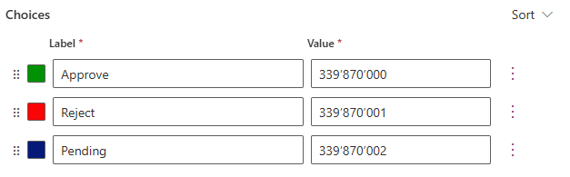
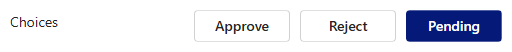
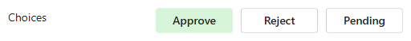

# OptionSet Buttons

The **OptionSet Buttons** component allows for an intuitive display of available choices in model-driven applications. It is designed to be associated with a `Choice` table column, presenting each choice as a button styled with designated colors.

## Features
- **Button display**: Each available choice is displayed as a button, making selection straightforward and visually appealing.
- **Customizable colors**: The background color of each button corresponds to the defined color for each choice in the table, enhancing user experience and clarity.
- **Text contrast**: The component automatically ensures appropriate contrast between button text and background color.
  - Light text color is applied for dark backgrounds.
  - Dark text color is used for light backgrounds.


## Configuration

To configure the **OptionSet Buttons** component:

- **Associate with `Choice` column**: Connect the component to a `Choice` table column within your form.
- **Define colors**: Set the background colors for each choice directly in the column configuration.



The component automatically calculates and applies the appropriate text color based on the button's background color to maintain readability.






You may set the button's value via script, specifying correct numerical values as defined in the options' configuration.

```javascript
//select a button
formContext.getAttribute("idapps_choices").setValue(339870000);
//or clear selection
formContext.getAttribute("idapps_choices").setValue(null);
```

Additional configuration options to **support multilingual** UI are **not required** in this case. Choices may be translated using native translation options available in Power Platform.
