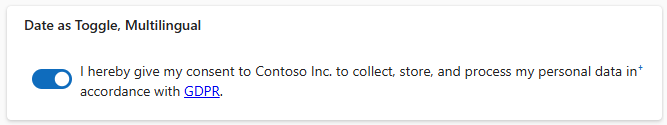
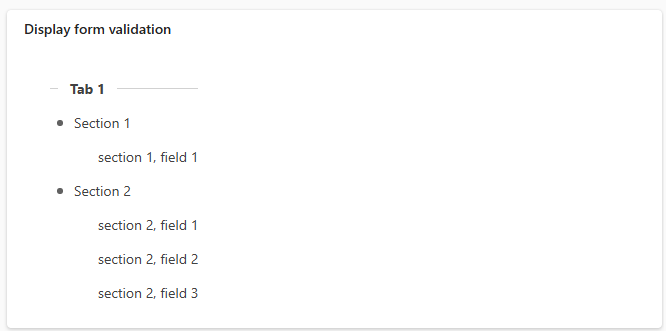
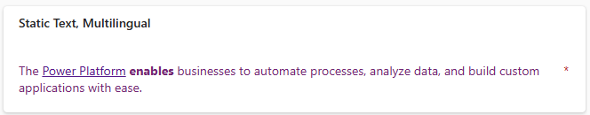
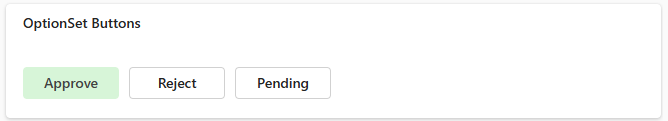
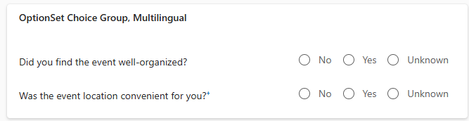
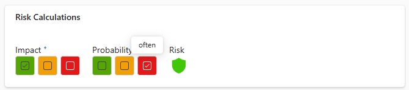

# PCF React components


  

 This solutions consists of the following components:
 - [Date As Toggle](README.md#date-as-toggle)
 - [JSON Display](README.md#json-display)
 - [Multilingual Text](README.md#multilingual-text)
 - [OptionSet Buttons](README.md#optionset-buttons)
 - [OptionSet Choice Group](README.md#optionset-choice-group)
 - [Resizable Text](README.md#resizable-text)
 - [Risk Calculations](README.md#risk-calculations)

## Date As Toggle
The **Date as Toggle** component is designed to interact with a `DateTime` column, offering an intuitive way to set or clear timestamps based on toggle actions.

It allows defining a description text that is separate from the field's label.

It fully supports multilingual configurations. The description text is displayed based on the detected user language.


See more: [Date As Toggle](./Components/DateAsToggle/README.md)

## JSON Display

The **JSON Display** component is designed to display form validation information in a list format, providing clear feedback to users about validation errors or issues.



See more: [JSON Display](./Components/JSONDisplay/README.md)

## Multilingual Text

The Multilingual Text component allows flexible display of static text in model-driven apps by associating it with a form field.

It displays text in different languages, based on user settings and component configuration.



See more: [Multilingual Text](./Components/MultilingualText/README.md)

## OptionSet Buttons

The OptionSet Buttons component is designed to be associated with a `Choice` table column, presenting each choice as a **button** styled with designated colors.

The component automatically calculates and applies the appropriate text color based on the button's background color to maintain readability.

Additional configuration options to support multilingual UI are not required in this case. Choices may be translated using native translation options available in Power Platform.



See more: [OptionSet Buttons](./Components/OptionSetButtons/README.md)

## OptionSet Choice Group

This component is designed to present choices defined in a `Choice` column table in a clear and organized way.

It supports multiple languages, ensuring the text displayed is appropriate for the user’s language settings. This option may be useful if the description associated with the choices is too long for the Power Platform translation mechanism.

Choices are rendered as radio-buttons either horizontally or vertically, and may be displayed inline with the custom text or below it, depending on the design preferences.



See more: [OptionSet Choice Group](./Components/OptionSetChoiceGroup/README.md)

## Resizable Text

This component is designed for use with a `Multiple lines of text` table column. It renders a customizable, resizable text area input. The placeholder text for empty states is displayed in user's language.


 [Resizable Text](./Components/ResizableText/README.md)

## Risk Calculations

This component calculates risk level based on the selected impact and probability values.

It supoprts any risk matrix configurations, relying on the provided `Risk Definition` JSON object.

It provides multilingual support, allowing to define labels for supported languages. The labels for impact, probability and risk choice columns may be translated using native translation options available in Power Platform.



See more: [Risk Calculations](./Components/RiskCalculations/README.md)


## Customizing the compoments

To rebuild the solution after you customized the components, run:

from ./Components/_Utils folder:
```bash
npm i
npm run build
```

from ./MultilingualComponents folder:
```bash
msbuild /t:build /restore
```

To build the solution in the debug configuration, generating unmanaged solution, run:

```bash
msbuild
```

To build the solution in the release configuration, generating managed solution, run:

```bash
msbuild /p:configuration=Release
```

To install the solution containing all components, navigate to  `\MultilingualComponents\bin\Release` and import the `MultilingualComponents.zip` file.
