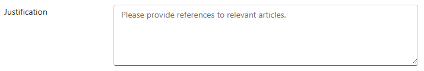
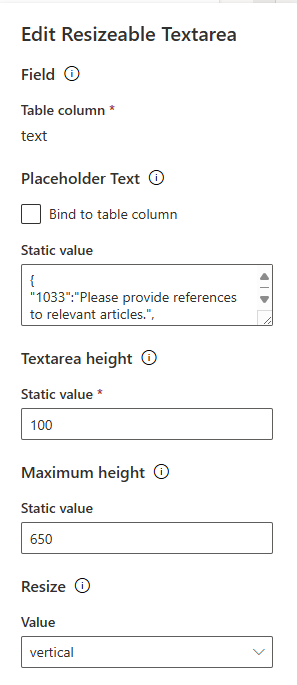

# Resizeable Textarea

The **Resizeable Textarea** component is designed for use with a `Multiple lines of text` table column. It renders a customizable, resizeable text area input, featuring the following key capabilities:

- **Custom Empty Placeholder**: Supports a custom placeholder text for empty states, with the ability to configure multilingual options.
- **Full-Width Layout**: The text area always takes up **100% of the available width**, ensuring it adapts to the size of its container.
- **Vertical Resizing**: **Vertical resizing is enabled** by default, allowing users to adjust the height based on the expected content and form layout. It may be disabled.
- **Height Configuration**: You can define **minimum and maximum height** settings to control the size of the text area.
Maximum height setting ensures that when the entered text exceeds the available space, a scrollbar will automatically appear. This prevents the text area from expanding indefinitely and maintains a clean interface.

## Configuration
To configure the Resizable Textarea component:

- **Add a Multiple Lines of Text column**: Include a `Multiple Lines of Text` column in your form and associate it with the **Resizable Textarea** component.
- **Set Placeholder Text**: Define the custom placeholder text in the properties, ensuring that it supports multilingual options as needed.
- **Configure dimensions**: Set the textarea to be resizable horizontally (or not). Specify the minimum and maximum height to control the component's appearance.

